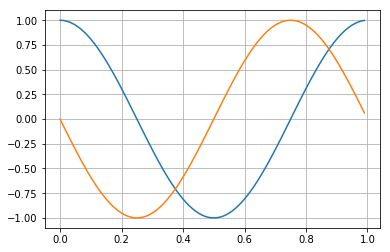
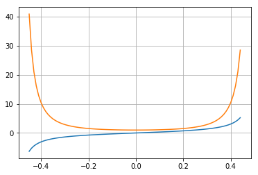
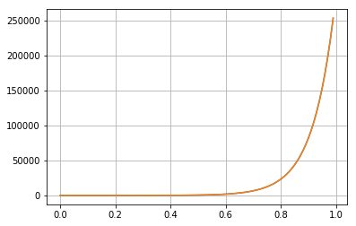
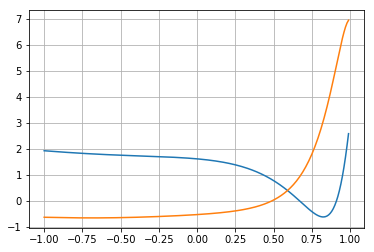

## Autodiff
Module for calculating gradient of any polynomial expression and most of standard functions.

### Usage documentation
Constants -
```python
zero = Constant(0)
one = Constant(1)
two = Constant(2)
three = Constant(3)
pi = Constant(np.pi)
```

Variables - 
```python
x = Variable("x")
y = Variable("y")
```

Functions - 
```python
tan = Function.Sin(zero) / Function.Cos(zero)
exp = Function.Exp(y)
tan = Function.Tan(x)
```

Initialize the variables -
```python
tan.update({'x':5, 'y':np.array([1,2,3])})
```

Evaluate the expression-
```python
tan.evaluate()
```

Calulate gradient of the expression-
```python
tan.grad()
```

Complete examples - 
```python
from autodiff import *
import matplotlib.pyplot as plt
import numpy as np

def plot(fun):
    # plot the function
    plt.plot(t, fun.evaluate())
    
    # plt the gradient
    plt.plot(t, fun.grad())
    
    plt.grid(True)
    plt.show()
```

#### Sin
```python
# range of plot
t = np.arange(0.0, 1.0, 0.01)
plot(Function.Sin(Constant(2*np.pi*t)))
```


#### Tan
```python
# range of plot
t = np.arange(-0.45, 0.45, 0.01)
# Tan
plot(Function.Tan(Constant(np.pi*t)))
```


#### Exponential
```python
# range of plot
t = np.arange(0.0, 1.0, 0.01)
# Exp function
plot(Function.Exp(Constant(2*2*np.pi*t)))
```



### Nested misc functions
```python
t = np.arange(-1, 1, 0.01)
exp = x**two + two*x + three * Function.Cos(Function.Exp(Function.Tan(x)))
exp.update({'x':t, 'y':t})
plot(exp)
```
